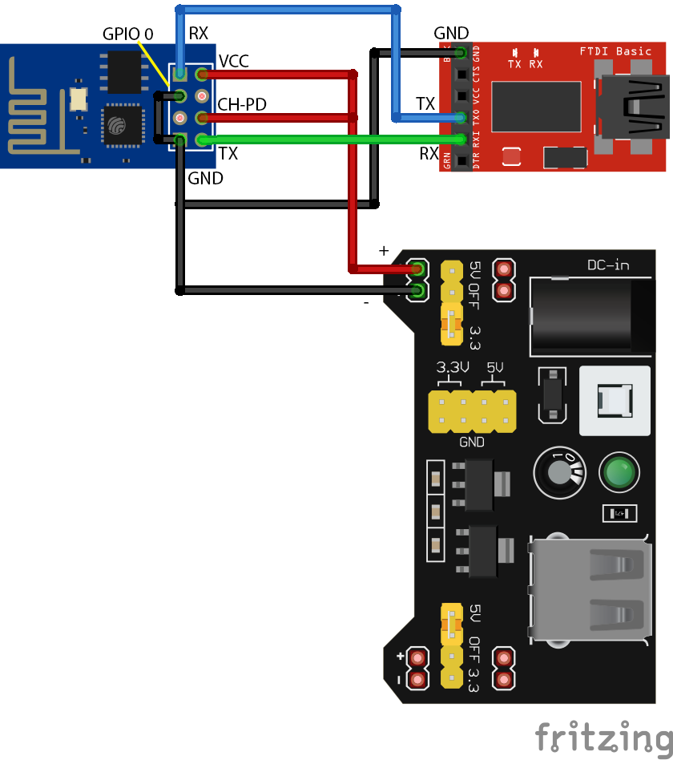
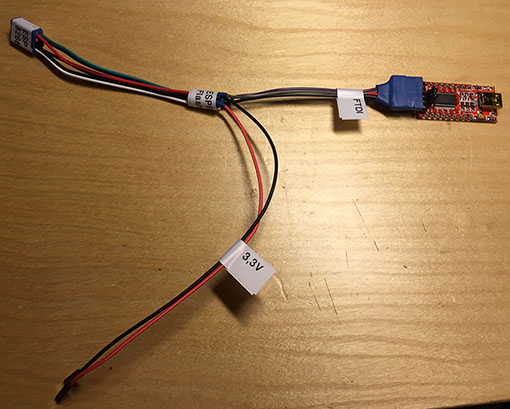
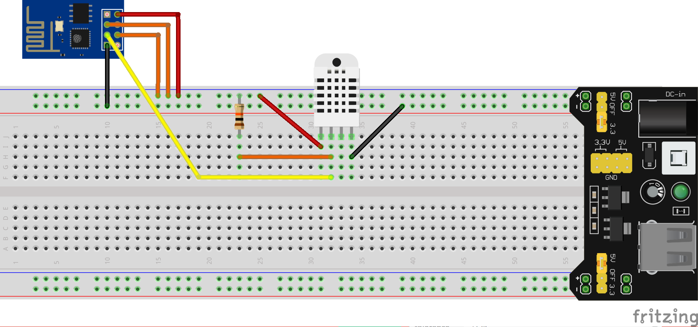

# ESP8266 Programming

The ESP8266 is a very affordable board with built in wifi, that can be programmed like an Arduino. It is small in size, but the simplest version only have two GPIO-ports. There are however other versions with more connections.

## Connecting the ESP8266 for flashing

In order to program it you need to connect it to your computer via an FTDI adapter. It may get power from your USB port via the FTDI adapter, provided you have an FTDI adapter with 3.3V output, but that is risky, since the wifi module uses a lot of power. I crashed my mac doing that, so I connected it to a separate power supply in stead.

Here is how you connect it all together for programming (flashing) the ESP8266 with your own software, for example using the Arduino IDE:



The power supply used here is a breadboard power supply that is connected to a 12V power supply and outputs 3.3V and 5V. You can use anything that gives you 3.3V with a few hundred milliamps.

Make sure you use the 3.3V power to the ESP8266!

There are many different ESP8266 boards, and many different FTDI adapters, so make sure you connect them right.

Also make sure you use 3.3V I/O level on the FTDI board. The FT232RL has a jumper where you can switch between 3.3V and 5V, and is convenient. If you only have 5V FTDI, buy a new, or create a voltage divider using two resistors on the TX port, so the RX port on the ESP8266 gets 3.3V.

### Wire connections

ESP8266          | FTDI             | Power            
---------------- | ---------------- | -----------------
GND              | GND              | GND (-)          
VCC              | <Do NOT connect> | + 3.3V           
RX               | TX               |                  
TX               | RX               |                  
CH-PD to VCC     |                  |                  
GPIO 0 to GND    |                  |                  
                 | USB to computer  | Power input for example from a std. 12V power supply


* Connect GND (-) on all boards together.
* The FTDI board gets VCC (+) from the USB port. VCC on the FTDI board should NOT be connected.
* Connect RX to TX and vice versa. 
* CH-PD is connected to VCC for some reason I don't remember.
* GPIO 0 is connected to GND to boot the ESP8266 in flash mode. Remember, this connection is for flashing.

-----

Here is pinout for this version of the ESP8266:


Since you are probably going to connect the ESP8266 this way many times, it is a good idea to create a special cable for this purpose. Here is mine:



I used standard dupont wire cables for all the pins, and just cut away the wires on unused connectors. Then I used shrink plastic to hold them together, but tape would probably also do. The cables that should be connected to multiple ends, I soldered in the middle, and isolated with shrink plastic (tape would do).

## Flashing the ESP8266

You can use the Arduino IDE, and write code as for any other Arduino, to program the ESP8266. Just remember that it has very limited IO-ports.

Connect the board to the computer using an FTDI adapter, an external power supply and a cable as described above.

Please note that you need to install a driver for the FDTI adapter, if you haven't done that before.

In the Arduino IDE, select the right port for the FTDI adapter. On my mac it is /dev/cu.usbserial-A50285BI, but it may be different. It is easy to find, because it is visible in the Arduino IDE menu when the FTDI adapter is connected (and the driver is installed), and not visible when not connected.

Some times I have to restart my mac in order to find the USB port in the Arduino IDE. I haven't tried to find out why.

As board, select "Generic ESP8266 Module". If it is not there, it can be installed using the Board manager. Search for ESP8266.

### Example

As an example for using the ESP8266, I have connected it to a DHT22 which can read temperature and humidity, and I transfer the data to [ThingsPeak.com](https://thingspeak.com/) via wifi so I can read them on the internet.

Here is the wiring:



Double check that you are using 3.3V from the power supply!

In order to use ThingSpeak.com, just create an account and a channel. It is very easy. You need to find the channel id and the API key in there, but that should not be too hard.

Below is the example code. It reads humidity and temperature from the sensor, and transfer it to ThingSpeak.com every minute.

```cpp
#include "DHT.h"
#include "ThingSpeak.h"
#include "ESP8266WiFi.h"

#define DHTPIN 2
#define DHTTYPE DHT22

DHT dht(DHTPIN, DHTTYPE);
WiFiClient  client;

char ssid[] = "YourNetwork";
char pass[] = "yournetworkpassword";
unsigned long myChannelNumber = 12345;
const char * myWriteAPIKey = "SECRETTHINGSPEAKKEY";

long previousMillis = 0;
long interval = 60000;

void setup() {
  WiFi.begin(ssid, pass);
  ThingSpeak.begin(client);
  dht.begin();
}

void loop() {
  unsigned long currentMillis = millis();
  if(currentMillis - previousMillis > interval) {
    previousMillis = currentMillis;
    float temperature = dht.readTemperature();
    float humidity = dht.readHumidity();
    ThingSpeak.setField(1, temperature);
    ThingSpeak.setField(2, humidity);
    ThingSpeak.writeFields(myChannelNumber, myWriteAPIKey);
  }
}
```
Create a new Arduino project, paste the code, enter the right data for

* Wifi network SSID
* Wifi password
* ThingSpeak channel
* ThingSpeak API key

Compile and upload the code to the ESP8266 using the flash connection above. Remove the flash-connector and connect the parts as described above with the DHT22. Power up, wait a minute and take a look at ThingSpeak.com.

In order to just test ThingSpeak.com, here is a very simple Python script that transfers som fake data:

```python
import requests
import random
from time import sleep

url = 'https://api.thingspeak.com/update'
key = 'SECRETTHINGSPEAKKEY2'
channel = 12346

temp = random.uniform(10,25)
hum = random.uniform(10, 80)

for t in range(120):
    temp += random.random() - 0.5
    hum += (random.random() - 0.5) * 3
    data = {'channel_id': channel, 'api_key': key, 'field1': temp, 'field2': hum}
    res = requests.post(url, data=data)
    if res.status_code == 200:
        print('Successfully updated channel with:  Temp: {}   Hum: {}'.format(temp, hum))
    sleep(60)

```


Thingspeak logo white
Channels 
Apps
Blog
Support 
Account 
Sign Out
Smoky
Channel ID: 144820
Author: ottopaulsen
Access: Public Data from smoke house
Private View
Public View
Channel Settings
API Keys
Data Import / Export

 Add Visualizations  Data Export
MATLAB Analysis MATLAB Visualization
Channel Stats
Created 12 days ago
Updated less than a minute ago
Last Entry  less than a minute ago
5434 Entries
Field 1 Chart 

 


